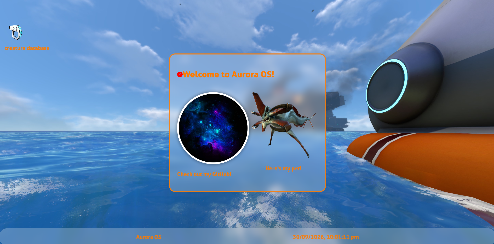
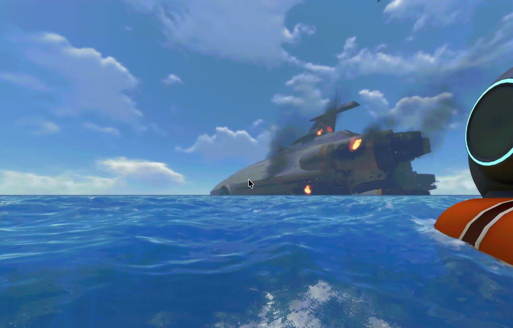

# AuroraOS

# What is this
This is a WebOS site I created for the stardance mission WebOS. This WebOS is themed around subnautica and currently has some simple but still good features.

# How to access it
There are two ways you can access this site

* Access the site at this link: https://waffles-888.github.io/AuroraOS/

* Downloading and opening it locally
1. Download the zip by clicking the green code button at the top then download as zip
2. Unzip the folder
3. Double click index.html

# Features
These are the current site features, I'm proud with how it has turned out and will add more later on.

* A sonar effect on the desktop when clicked
* The ability to deselect an icon by clicking the empty part of the desktop
* Apps actually pop out in their own window

This is a demo of the sonar effect which i am quite proud of:

# Avaliable apps

These are the current apps but more will be added in the future

* A simple creature database (Not massive but will be improved on)

# Credits
* Bootstrap was used for some icons across this site
* Creature images in the database app were taken off the subnautica fandom wiki